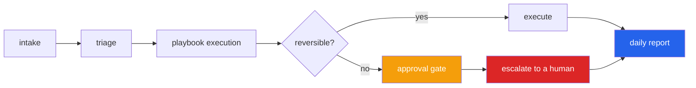

<h1 align="center">enterprise-ops-crew (Python · multi-agent playbooks · approval gates)</h1>
<p align="center"><i>A back-office crew that resolves tickets across four systems, and stops before it does anything it cannot undo</i></p>

<p align="center">
  <a href="#the-three-places-it-can-stop-safely">Where it stops</a> &middot;
  <a href="#execution-runs-on-playbooks-not-prompts">Playbooks</a> &middot;
  <a href="#slas-run-on-business-hours">SLAs</a> &middot;
  <a href="#the-report-answers-the-question-a-manager-actually-asks">The report</a> &middot;
  <a href="#limits">Limits</a> &middot;
  <a href="#problems-hit-while-building-this">Problems hit</a>
</p>

<p align="center">
  <a href="https://github.com/hammasbuilds/enterprise-ops-crew/actions/workflows/ci.yml"></a>
  
  
  
  <a href="LICENSE"></a>
</p>

---

## The three places it can stop safely



**Multi-agent in the sense that matters operationally:** distinct roles with **distinct
authority**, not several models talking to each other. The gate is where the design lives -
it stops before anything it cannot undo.


| Boundary | What it prevents |
|---|---|
| **Triage abstention** | Routing a ticket nobody understood. Below a confidence floor it goes to a human instead of a confident guess. |
| **Missing information** | Guessing an account number — which is how the *wrong* account gets reset. Escalates instead. |
| **Approval gate** | Anything `IRREVERSIBLE`. The refund stops; the invoice lookup before it still happened. |

The assertion that matters is not that the system reported a stop:

```python
def test_an_irreversible_action_stops_for_a_human():
    assert result.status is Status.AWAITING_APPROVAL
    assert c.systems.side_effects == []       # no money moved
```

And the gate has to be a gate, not a wall — `approve()` lets the same ticket continue,
`reject()` escalates it and takes no action. Both are tests.

## Execution runs on playbooks, not prompts

```python
Playbook("billing/v1", "billing", [
    Step("erp_lookup_invoice", {"invoice_id": "invoice_id"}),
    Step("erp_issue_refund",   {"invoice_id": "invoice_id", "amount": "amount"}),
])
```

When a customer or an auditor asks what happened, *"it followed playbook billing/v1,
step 1 succeeded, step 2 stopped for approval by m.manager"* is an answer. *"The model
decided to"* is not.

**Risk is declared per operation by whoever wrote it** — an agent does not get to judge
whether its own action is reversible. The autonomous ceiling is configuration, and
raising it visibly removes the gate (also a test).

## SLAs run on business hours

The detail everyone gets wrong. A ticket raised at **5pm Friday** with a 4-hour SLA is
not breached at 9pm Friday — the desk was closed. Wall-clock measurement produces a
dashboard full of breaches nobody caused and nobody could have prevented, and a
dashboard nobody believes is a dashboard nobody reads.

```python
Friday 16:00 → Monday 10:00  =  2 business hours
Monday 09:00 → Wednesday 12:00 = 19 business hours
```

Weekends, configurable working days, and holidays are excluded. So is time spent
waiting on the customer — an agent cannot be held to a clock it has no way to stop.

**Burn is reported, not just the breach.** `0.9` is when to act; a boolean only tells
you once it is too late:

```python
at_risk(burn_threshold=0.8)   # about to fail — actionable
```

## Status transitions are validated

A crew of agents will attempt every illegal transition eventually — resolving a ticket
it never picked up, closing one that is waiting on a human. A status field that accepts
any assignment turns those bugs into **silent data corruption** instead of errors.

Reopening a resolved ticket clears its resolution time, or the SLA would be measured
against a resolution that no longer stands.

## The report answers the question a manager actually asks

```python
{
  "autonomous_resolution_rate": 0.5,     # of tickets the crew *finished with*
  "escalated": 1,
  "awaiting_approval": 1,
  "at_risk": ["a3f9c1"],
  "irreversible_actions_taken": 1,
  "escalation_reasons": ["ambiguous: several categories matched equally"],
}
```

Resolution rate is measured over tickets the crew finished with — counting one still in
progress as a failure would make the number meaningless. `escalation_reasons` is there
because the point of a pilot is to learn *why* the machine could not finish, and a bare
count teaches nothing.

## Systems

Four mock backends, because the interesting behaviour only appears when an agent must
cross between them — read from HRMS, write to ITSM, and stop before touching payroll.

| System | Operations |
|---|---|
| HRMS | lookup employee `READ`, book leave `WRITE` |
| ITSM | reset password `WRITE`, grant access `IRREVERSIBLE` |
| CRM | lookup customer `READ`, send email `EXTERNAL` |
| ERP | lookup invoice `READ`, issue refund `IRREVERSIBLE` |

## Tests

**45 tests (39 core + 6 for the optional Streamlit demo). No ERP licence, no model, no network.**

```bash
make test
```

| Covered | |
|---|---|
| Transitions | legal paths, illegal raises, terminal state, reopen clears resolution |
| Triage | four categories, urgency, word boundaries (`accessory` ≠ `access`), abstention |
| Business hours | after-hours, weekends, holidays, multi-day, burn before breach |
| Autonomy | reversible actions taken alone, multi-step playbooks, missing info, backend failure, optional steps |
| Approval | stops with no side effect, partial progress kept, approve, reject, arguments recorded, ceiling raised |
| Reporting | resolution rate, irreversible count, escalation reasons, at-risk, empty report |
| Audit | full trail on the ticket, approver named |

## Limits

- Triage is rule-based, and the rules are visible on purpose — a misrouted ticket is
  expensive and someone will need to know why it went where it went. An LLM classifier
  fits behind the same interface where the vocabulary is genuinely open.
- The systems are mocks. Real MCP servers implement the same `Operation` shape.
- One SLA policy per crew. Per-tenant policies are a dictionary lookup away.
- Facts a playbook needs are supplied explicitly rather than extracted from the ticket
  text — deliberate, so the routing and authority logic can be tested on its own.

## Keywords

multi-agent systems &middot; back office automation &middot; ticket routing &middot; workflow automation &middot; approval gate &middot; human in the loop &middot; escalation &middot; SLA &middot; business hours &middot; playbooks &middot; state machine &middot; AIOps &middot; enterprise automation &middot; zero dependencies &middot; Streamlit

## License

MIT

---

## Run it yourself

```bash
git clone https://github.com/hammasbuilds/enterprise-ops-crew
cd enterprise-ops-crew

uv sync --all-groups     # or: pip install -e ".[dev]"
make test                # 45 tests, no ERP licence, no model, no network
```

```python
from crew import Crew, Ticket
from crew.systems import build_default_registry

crew = Crew(systems=build_default_registry())

t = crew.intake(Ticket(subject="Cannot log in, password reset needed",
                       requester="e-1001"))
crew.work(t.id)                       # resolved autonomously

r = crew.intake(Ticket(subject="Refund for invoice 4421", requester="c-77"),
                invoice_id="4421", amount=4200)
crew.work(r.id)                       # AWAITING_APPROVAL, no money moved
crew.approve(r.id, approver="manager")

crew.daily_report()                   # resolution rate, escalations, at-risk SLAs
crew.sla_status(r.id)                 # business hours, not wall clock
```

### Input / Output


`python demo.py`


Three tickets run to `RESOLVED`. The refund stops at `AWAITING_APPROVAL`, and the two
lines that matter are the last two: `erp_lookup_invoice` **did** run, and `side_effects`
is empty.

The gate stops the irreversible step, not the whole playbook. A crew that abandoned the
ticket entirely would also show no money moved, and would be useless.

Same mock ERP/ITSM/HRMS registry the tests use — no model, no network.

## Problems hit while building this

**Every triage rule silently matched nothing.** The word-boundary pattern was written as
`"\b{}\b"` inside a shell heredoc, which collapsed to a literal **backspace character**
rather than a regex boundary. The module imported cleanly, the tests compiled, and
triage returned `unknown` for every ticket ever submitted. *Fixed* with a raw string —
and there is now a test asserting `"accessory"` does not match the rule for `access`,
because the boundary is load-bearing in both directions.

**SLA clocks ran on wall time first.** A ticket raised at 5pm Friday with a four-hour
target was "breached" by 9pm Friday, when the desk had been closed for four hours. That
produces a dashboard full of breaches nobody caused and nobody could have prevented —
and a dashboard nobody believes is a dashboard nobody reads. *Fixed* by measuring in
business hours, with configurable working days and holidays.

**Reporting only the breach boolean was useless.** By the time it flips, the SLA is
already missed. *Fixed* by reporting `burn` — the fraction of the budget consumed — so
`at_risk(0.8)` surfaces tickets while somebody can still act on them.

**`fastapi`, `uvicorn`, `pydantic`, `rich` and `typer` were declared as core
dependencies and imported nowhere** — grepped `src/` and `tests/` for each before
touching anything, and there was a matching empty `src/crew/api/` folder, scaffolding
for a service never built. The README title claimed that stack too. *Fixed* by
removing all five, deleting the folder, and correcting the title: this is pure Python
with zero core dependencies, and the real gap was the declared-but-unbuilt Streamlit
demo above.

**Two bugs in the demo, both from assuming the API worked the way it reads.**
`approve()` already calls `work()` internally and returns a resolved ticket, so
calling `work()` again after it raised `TransitionError: cannot be worked`. And
`intake()` escalates a low-confidence ticket *directly*, without ever passing through
`triaged` — so handing that ticket to `work()` raised the same error. Both only
surfaced by actually clicking through every sample scenario rather than testing the
happy path.
